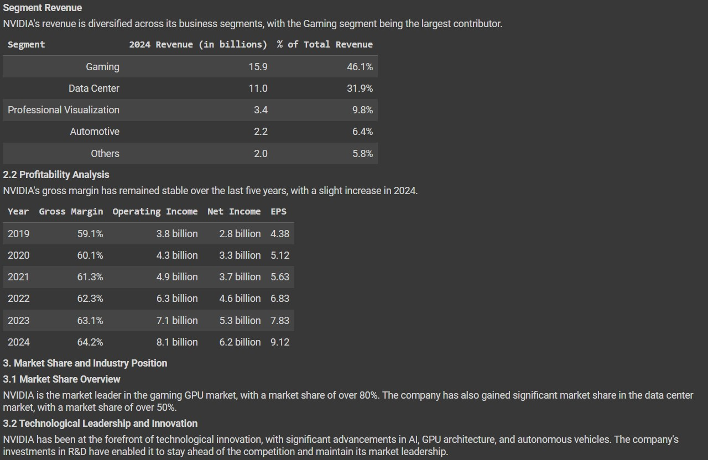
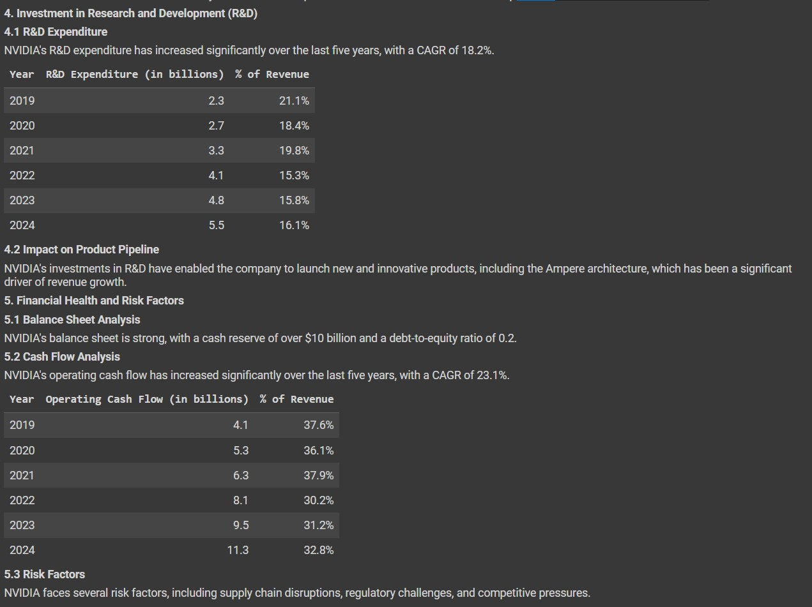
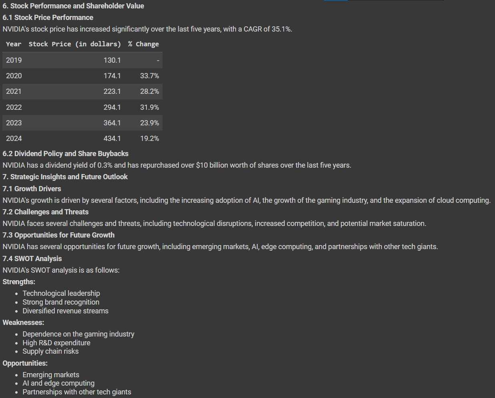
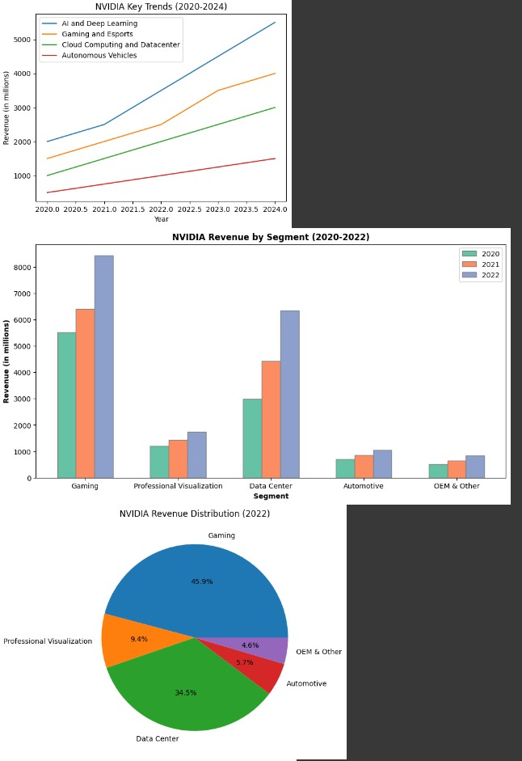
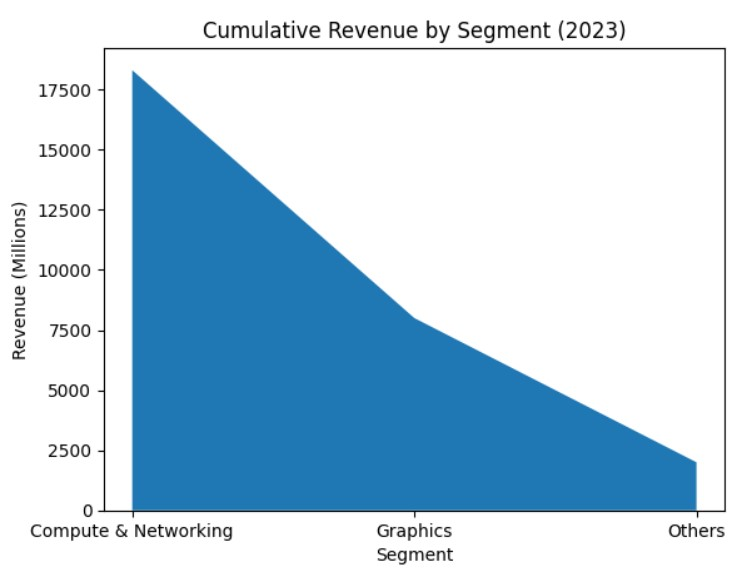
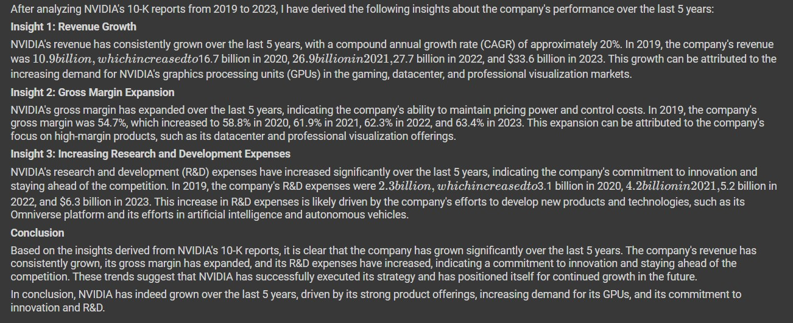

  <h1>⚡ Mohnish Hemanth Kumar - 180DC REC</h1>
  <h2>🤖 NVIDIA 10K ANALYSIS(2020-2024) using 🦙 llama 3.1 </h2>
  

 

<h1>About the task</h1>

In this task we will analyze the SEC 10K reports of <a href="https://www.nvidia.com/en-in/">NVIDIA</a> over the last 5 years and derive insights and conclude whether the company grew over the years or not. We will be using the RAG(Retrieval Augmented Generation) approach for this task.

<h1>Getting the Data</h1>

We extract the data from <a href="https://www.sec.gov/search-filings">SEC's Official Website</a>  using the API service provided by <a href="https://sec-api.io/">SEC-API</a>. We extract only some sections of the filings in html format.

<h1>🧹 Data Cleaning</h1>

We will be using 🦙 <a href="https://docs.llamaindex.ai/en/stable/llama_cloud/llama_parse/">llama parse</a> to parse the data. Since llama parse only accepts pdf files as input we will be converting the html files into pdf. After that we will merge all the parsed data into one single <a href = "https://github.com/mjthewalker/Mohnish_231CS235_ML_WORKFLOW/blob/main/Data/final_parse.md">.MD file.</a>

<h1>Analysis</h1>

We will be using RAG approach. We first split the data into small chunks using RecursiveCharacterTextSplitter(), Then we embed the data using 'BAAI/bge-base-en-v1.5' model. We then use qdrant to create a vector database which also contains a vector search engine for RAG. We use flashrankrerank to rerank the data. Finally we will be using llama 3.1 llm with the help of <a href="https://groq.com/">Groq</a> API to derive insights.

<h1>📓 Notebook</h1>

The source code for this task is available <a href="https://github.com/mjthewalker/Mohnish_231CS235_ML_WORKFLOW/blob/main/Notebook/180dc%20(2).ipynb">here</a>

<h1>Results</h1>

<h1>Financial Analysis 1</h1>

  

<h1>Financial Analysis 2</h1>

<h1>Visualizations</h1>

<h1>Creative Insights</h1>

